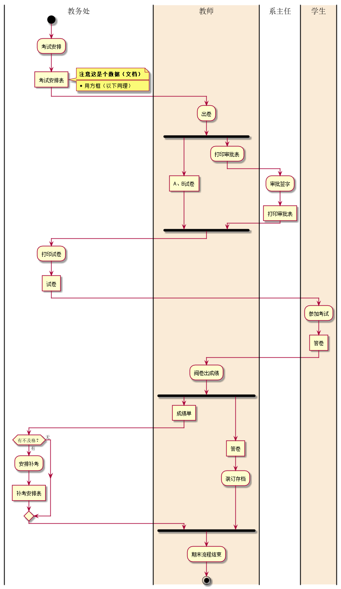
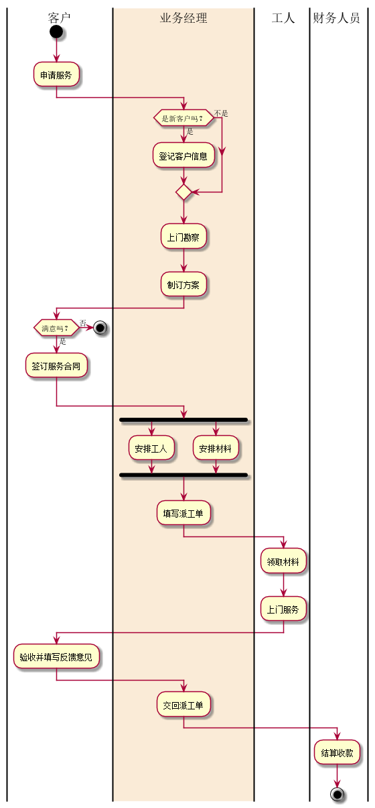

# 实验1：业务流程建模
|学号|班级|姓名|照片|
|:-------:|:-------------: | :----------:|:---:|
|201610414206|软件(本)16-2|1.郭高余||

## 流程图1：考试及成绩管理流程

**PlantUML源码如下：**

``` flow1
@startuml
|教务处|
start
:考试安排;
:考试安排表]
note right
<b>注意这是个数据（文档）</b>
====
*用方框（以下同理）
end note
|#AntiqueWhite|教师|
:出卷;
fork
:A、B试卷]
fork again
:打印审批表;
|系主任|
:审批签字;
:打印审批表]
end fork
|教务处|
:打印试卷;
:试卷]
|#AntiqueWhite|学生|
:参加考试;
:答卷]
|教师|
:阅卷出成绩;
fork
:成绩单]
|教务处|
if(有不及格？)then(有)
:安排补考;
:补考安排表]
else(无)
endif
|教师|
fork again
:答卷]
:装订存档;
end fork
:期末流程结束;
stop

@enduml
```

**业务流程图如下：**



**流程说明：**

使用泳道(SwimLane)将角色分类，流程可根据流程图一步一步按部就班，注意其中有些是数据(文档)不是处理流程在后面添加特殊领域语言(SDL)设置为不同的形状。

## 流程图2： 客户维修服务流程

**PlantUML源码如下：**

``` flow2
@startuml

|客户|
start
:申请服务;
|#AntiqueWhite|业务经理|
if(是新客户吗？) then(是)
:登记客户信息;
else(不是)
endif
:上门勘察;
:制订方案;
|客户|
if(满意吗？) then(是)
:签订服务合同;
else(否)
stop
endif
|业务经理|
fork
:安排工人;
fork again
:安排材料;
fork end
:填写派工单;
|工人|
:领取材料;
:上门服务;
|客户|
:验收并填写反馈意见;
|业务经理|
:交回派工单;
|财务人员|
:结算收款;
stop
@enduml
```

**业务流程图如下：**



**流程说明：**

同理将角色分类，再根据流程按部就班