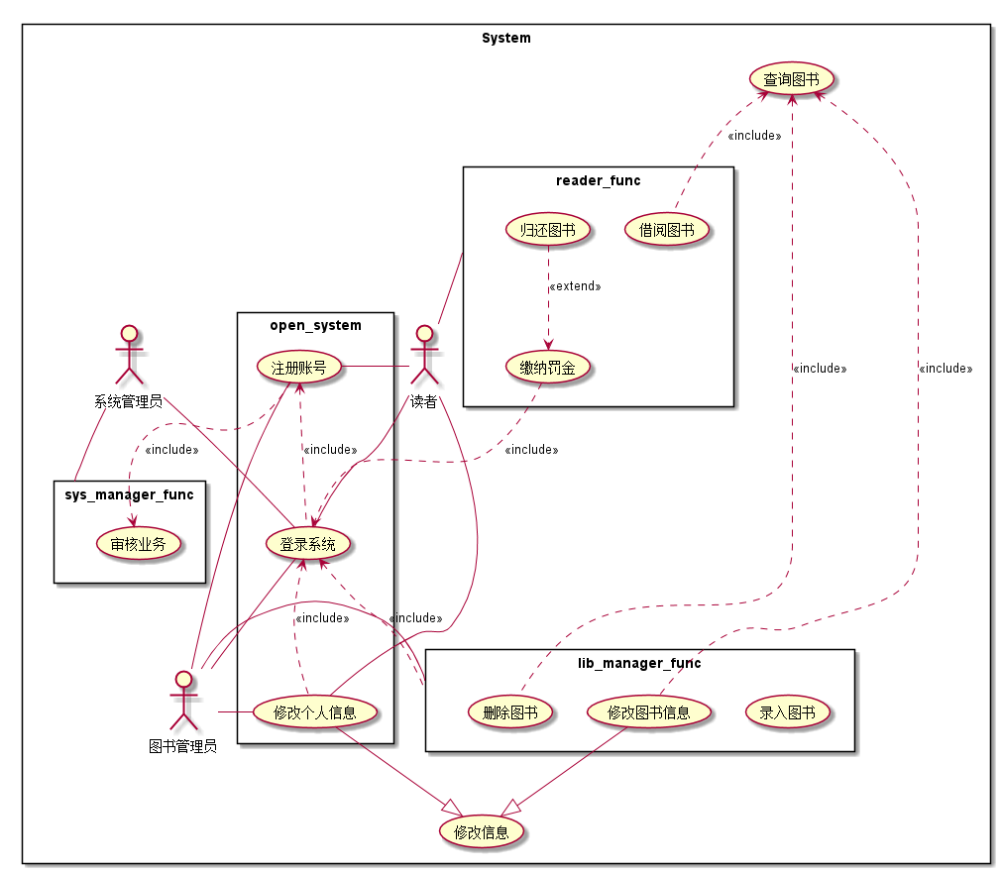

# 实验2：图书管理系统用例建模
|学号|班级|姓名|照片|
|:-------:|:-------------: | :----------:|:---:|
|201610414206|软件(本)16-2|郭高余||

### 说明：
主要目的就是说明清楚各个用例和参与者，再对各个用例扩展说明，可能会使用用例规约以及流程图。
## 1. 图书管理系统的用例关系图

### 1.1 用例图PlantUML源码如下：

``` usecase
@startuml

rectangle System{

    actor :系统管理员: as sys_manager
    actor :图书管理员: as lib_manager
    actor :读者: as reader

    usecase (修改信息) as modify_info
    usecase (查询图书) as search_book

    rectangle  open_system{
        usecase (登录系统) as sign_in
        usecase (注册账号) as sign_up
        usecase (修改个人信息) as modify_self_info

        sign_in .up.> sign_up : <<include>>
        modify_self_info .up.> sign_in : <<include>>
    }

    rectangle reader_func{
        usecase (借阅图书) as borrow_book
        usecase (归还图书) as return_book
        usecase (缴纳罚金) as pay_revenue

        return_book .down.> pay_revenue : <<extend>>
    }

    rectangle lib_manager_func{
        usecase (录入图书) as add_book
        usecase (删除图书) as del_book
        usecase (修改图书信息) as modify_book_info


    }

    rectangle sys_manager_func{
        usecase (审核业务) as review_app
    }

    sign_in -left- reader
    sign_up -left- reader
    modify_self_info -left- reader
    reader_func -down- reader

    sign_in -right- lib_manager
    sign_up -right- lib_manager
    modify_self_info -right- lib_manager
    lib_manager -right- lib_manager_func

    sys_manager -down- sign_in
    sys_manager -right- sys_manager_func

    modify_self_info -down-|> modify_info
    modify_book_info -down-|> modify_info

    borrow_book .up.> search_book : <<include>>
    modify_book_info .up.> search_book : <<include>>
    del_book .up.> search_book : <<include>>
    pay_revenue .right.> sign_in : <<include>>
    lib_manager_func .up.> sign_in : <<include>>
    sign_up ..> review_app : <<include>>


}

@enduml
```


### 1.2. 用例图如下：

参见图7.6



## 2. 参与者说明：

###     2.1 图书管理员

主要职责是：***

###     2.2 读者

主要职责是：****

###     2.3 其他类型用户
    
主要职责是：****

##     3. 用例规约表

###     3.1 “借出图书”用例

参见：表7.5

###     3.2 “购入图书”用例

参见：表7.5

**“购入图书”用例流程图源码如下：**
``` uc1_flow
@startuml
start
:Hello world;
:This is on defined on
several **lines**;
stop
@enduml
```

**“购入图书”用例流程图源码如下：**


###     3.3 “***”用例

参见：表7.5
