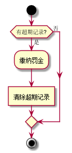

# 实验2：图书管理系统用例建模
|学号|班级|姓名|照片|
|:-------:|:-------------: | :----------:|:---:|
|201610414206|软件(本)16-2|郭高余||

### 说明：
主要目的就是说明清楚各个用例和参与者，再对各个用例扩展说明，可能会使用用例规约以及流程图。
## 1. 图书管理系统的用例关系图

### 1.1 用例图PlantUML源码如下：

``` usecase
@startuml

rectangle System{

    actor :系统管理员: as sys_manager
    actor :图书管理员: as lib_manager
    actor :读者: as reader

    usecase (修改信息) as modify_info
    usecase (查询图书) as search_book

    rectangle  open_system{
        usecase (登录系统) as sign_in
        usecase (注册账号) as sign_up
        usecase (修改个人信息) as modify_self_info

        sign_in .up.> sign_up : <<include>>
        modify_self_info .up.> sign_in : <<include>>
    }

    rectangle reader_func{
        usecase (借阅图书) as borrow_book
        usecase (归还图书) as return_book
        usecase (缴纳罚金) as pay_revenue

        return_book .down.> pay_revenue : <<extend>>
    }

    rectangle lib_manager_func{
        usecase (录入图书) as add_book
        usecase (删除图书) as del_book
        usecase (修改图书信息) as modify_book_info


    }

    rectangle sys_manager_func{
        usecase (审核业务) as review_app
    }

    sign_in -left- reader
    sign_up -left- reader
    modify_self_info -left- reader
    reader_func -down- reader

    sign_in -right- lib_manager
    sign_up -right- lib_manager
    modify_self_info -right- lib_manager
    lib_manager -right- lib_manager_func

    sys_manager -down- sign_in
    sys_manager -right- sys_manager_func

    modify_self_info -down-|> modify_info
    modify_book_info -down-|> modify_info

    borrow_book .up.> search_book : <<include>>
    modify_book_info .up.> search_book : <<include>>
    del_book .up.> search_book : <<include>>
    pay_revenue .right.> sign_in : <<include>>
    lib_manager_func .up.> sign_in : <<include>>
    sign_up ..> review_app : <<include>>


}

@enduml
```
说明：代码先按照功能模块分类，规划在各自的区域中，先定义参与者和抽象用例，再定义区域内的用例及相互的关系，然后再将参与者与各自对应的用例集相连，最后将用例之间的关系补充上。

### 1.2. 用例图如下：


--
说明：依照角色功能模块将用例分类，各个参与者与已分类的用例集相连，指代与其中用例分别相连。在此透明化了刷卡等类似动作的用例。
## 2. 参与者说明：

###     2.1 图书管理员

主要职责是：负责书记管理，能对书籍进行添加、删除、修改信息操作。

###     2.2 读者

主要职责是：能对书籍进行借阅、归还操作，也可能会有超过期限需要交纳罚金

###     2.3 系统管理员
    
主要职责是：负责用户注册账号的审理

##     3. 用例规约表


###     3.1 “登录”用例

|||
|:---|:---|
|用例名称|登录|
|参与者|读者、系统管理员、图书管理员|
|前置条件|注册账号|
|后置条件|进入系统|
|主事件流|
|参与者动作|系统行为|
|1.输入账号<br>2.输入密码|<br><br><br>3.验证账号密码|
|备选事件流|
|3a.密码错误<br>&nbsp;&nbsp;&nbsp;&nbsp;1.系统提示错误，结束用例<br>3b.账号不存在<br>&nbsp;&nbsp;&nbsp;&nbsp;1.系统提示账号不存在，结束用例|

**“登录“用例流程图源码如下：**
```
@startuml

start
:输入账号密码]
if (是否存在？) then(是)
    if (密码是否正确？) then(是)
        :进入系统;
    else (否)
        :提示：密码错误;
    endif
else (否)
    :提示：账号不存在;
endif
stop
@enduml
```
**“登录“用例流程图如下：**


###     3.2 “注册”用例


|||
|:---|:---|
|用例名称|注册|
|参与者|读者、图书管理员|
|前置条件|无|
|后置条件|系统管理员审核|
|主事件流|
|参与者动作|系统行为|
|1.输入信息|<br>2.存储信息<br>3.提交给系统管理员审核|
|备选事件流|
|1a.输入有非法字符<br>&nbsp;&nbsp;&nbsp;&nbsp;1.系统提示，重新输入|


**“注册”用例流程图源码如下：**
```
@startuml
(*)  --> "检查输入"
If "输入格式正确？" then
--> [Yes] "提交给系统管理员审核"
--> "存储账号密码"
-->(*)
else
--> [No] "检查输入"
Endif
@enduml
```

**“注册”用例流程图如下：**


###     3.3 “修改信息”用例


|||
|:---|:---|
|用例名称|修改个人信息|
|参与者|读者、图书管理员|
|前置条件|用户登录到系统|
|后置条件|存储信息|
|主事件流|
|参与者动作|系统行为|
|1.输入信息|<br>2.存储信息|
|备选事件流|
|1a.输入为空<br>&nbsp;&nbsp;&nbsp;&nbsp;1.系统提示，不能为空|


**“修改信息”用例流程图源码如下：**
```
@startuml
(*)  --> "检测输入为空"
If "输入不为空" then
--> [Yes] "存储信息"
-->(*)
else
--> [No] "检测输入为空"
Endif
@enduml
```

**“修改信息”用例流程图如下：**


###     3.4 “借阅图书”用例


|||
|:---|:---|
|用例名称|借阅书籍|
|参与者|读者|
|前置条件|书籍查询成功|
|后置条件|借阅成功或者不能借阅|
|主事件流|
|参与者动作|系统行为|
|1.输入书名<br><br>3.借阅书籍|<br>2.查询书籍|
|备选事件流|
|2.a未找到查询结果<br>&nbsp;&nbsp;&nbsp;&nbsp;1.系统显示没有结果<br>3a.已借出<br>&nbsp;&nbsp;&nbsp;&nbsp;1.系统提示不能借阅<br>3b.已达到借阅上限<br>&nbsp;&nbsp;&nbsp;&nbsp;1.系统提示达到上限，无法借阅|

**“借阅图书”用例流程图源码如下：**
```
@startuml
start
:输入书名]
if (是否查询到结果？) then(Yes)
    if (是否能借阅？) then(Yes)
        :借阅图书]
    else (No)
    endif
else (No)
    :提示没有结果;
endif
stop
@enduml
```

**“借阅图书”用例流程图如下：**


###     3.5 “归还图书”用例


|||
|:---|:---|
|用例名称|归还图书|
|参与者|读者|
|前置条件|书籍有借出记录|
|后置条件|归还成功，清除借阅记录|
|主事件流|
|参与者动作|系统行为|
|1.归还书籍|<br>2.消除借阅记录|
|备选事件流|
|无|


**“归还图书”用例流程图源码如下：**
```
@startuml
start
:归还图书;
:清除借阅记录]
stop
@enduml
```

**“归还图书”用例流程图如下：**


###     3.6 “缴纳罚金”用例


|||
|:---|:---|
|用例名称|缴纳罚金|
|参与者|读者|
|前置条件|借阅超过期限|
|后置条件|清除超期记录|
|主事件流|
|参与者动作|系统行为|
|1.缴纳罚金|<br>2.清除超期记录|
|备选事件流|
|无|


**“”用例流程图源码如下：**
```
@startuml
start
if (有超期记录) then(是)
    :缴纳罚金;
    :清除超期记录]
else (否)
endif
stop
@enduml
```

**“”用例流程图如下：**



###     3.7 “录入图书”用例


|||
|:---|:---|
|用例名称|录入图书|
|参与者|图书管理员|
|前置条件|已登录系统|
|后置条件|添加成功，存储图书信息|
|主事件流|
|参与者动作|系统行为|
|1.输入图书信息|<br>2.存储图书信息|
|备选事件流|
|1a.输入信息存在非法字符或信息为空<br>&nbsp;&nbsp;&nbsp;&nbsp;1.系统提示，重新输入|


**“”用例流程图源码如下：**
```
@startuml
(*)  --> "输入图书信息"
If "输入是否存在异常？" then
--> [Yes] "系统提示重新输入"
--> "输入图书信息"
else
--> [No] "存储图书信息"
Endif
--> (*)
@enduml
```

**“”用例流程图如下：**


###     3.8 “删除图书”用例


|||
|:---|:---|
|用例名称|删除图书|
|参与者|图书管理员|
|前置条件|已登录系统|
|后置条件|删除成功，删除图书信息|
|主事件流|
|参与者动作|系统行为|
|1.输入图书信息<br><br>3.删除图书|<br>2.查询图书并显示查询结果<br<br>4.删除图书信息|
|备选事件流|
|2a.没有查询结果<br>&nbsp;&nbsp;&nbsp;&nbsp;1.系统提示没有查询结果，退出用例|

**“删除图书”用例流程图源码如下：**
```
@startuml
start
:输入图书信息]
:查询图书;
if (是否有查询结果?) then(有)
    :删除图书;
    :删除图书信息]
else (无)
    :系统提示，没有查询结果;
endif
stop
@enduml
```

**“删除图书”用例流程图如下：**


###     3.9 “审核”用例


|||
|:---|:---|
|用例名称|审核|
|参与者|系统管理员|
|前置条件|已登录系统|
|后置条件|存储已审核通过的信息或反馈没有通过的信息|
|主事件流|
|参与者动作|系统行为|
|1.审核|<br>2.存储审核结果|
|备选事件流|
|无|


**“审核”用例流程图源码如下：**
```
@startuml
start
:审核;
:提交审核结果]
:存储审核结果;
stop
@enduml
```

**“审核”用例流程图如下：**


###     3.10 “查询图书”用例


|||
|:---|:---|
|用例名称|查询图书|
|参与者|读者、图书管理员|
|前置条件|无|
|后置条件|显示查询结果|
|主事件流|
|参与者动作|系统行为|
|1.输入查询信息|<br>2.检索数据<br>3.显示结果|
|备选事件流|
|3a.没有搜索到结果<br>&nbsp;&nbsp;&nbsp;&nbsp;1.系统显示没有查询结果|


**“”用例流程图源码如下：**
```
@startuml
start
:输入图书信息]
:检索;
if (有查询结果?) then(有)
    :显示查询结果;
else (无)
    :显示没有结果;
endif
stop
@enduml
```

**“”用例流程图如下：**

