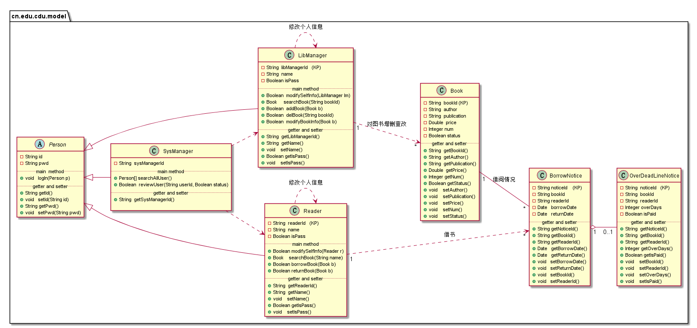
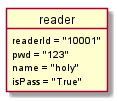
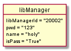
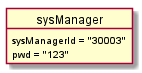
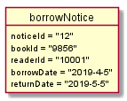
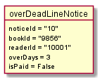

# 实验3：图书管理系统领域对象建模
|学号|班级|姓名|照片|
|:-------:|:-------------: | :----------:|:---:|
|201610414206|软件(本)16-2|HolyKwok||

## 1. 图书管理系统的类图

### 1.1 类图PlantUML源码如下：

``` class
@startuml
left to right direction
package cn.edu.cdu.model{
    Abstract Person{
        {field}-String id
        -String pwd
        ..main  method..
        +void   logIn(Person p)
        ..getter and setter..
        +String getId()
        +void   setId(String id)
        +String getPwd()
        +void   setPwd(String pwd)
    }
    class Reader {
        {field}-String  readerId   (KP)
        -String  name
        -Boolean isPass
        ..main method..
        +Boolean modifySelfInfo(Reader r)
        +Book    searchBook(String name)
        +Boolean borrowBook(Book b)
        +Boolean returnBook(Book b)
        ..getter and setter..
        +String  getReaderId()
        +String  getName()
        +void    setName()
        +Boolean getIsPass()
        +void    setIsPass()
    }

    class LibManager{
        {field}-String  libManagerId   (KP)
        -String  name
        -Boolean isPass
        ..main method..
        +Boolean  modifySelfInfo(LibManager lm)
        +Book     searchBook(String bookId)
        +Boolean  addBook(Book b)
        +Boolean  delBook(String bookId)
        +Boolean  modifyBookInfo(Book b)
        ..getter and setter..
        +String  getLibManagerId()
        +String  getName()
        +void    setName()
        +Boolean getIsPass()
        +void    setIsPass()
    }

    class SysManager{
        -String  sysManagerId
        ..main method..
        +Person[] searchAllUser()
        +Boolean  reviewUser(String userId, Boolean status)
        ..getter and setter..
        +String  getSysManagerId()

    }

    class Book{
        {field}-String  bookId (KP)
        -String  author
        -String  publication
        -Double  price
        -Integer num
        -Boolean status
        ..getter and setter..
        +String  getBookId()
        +String  getAuthor()
        +String  getPublication()
        +Double  getPrice()
        +Integer getNum()
        +Boolean getStatus()
        +void    setAuthor()
        +void    setPublication()
        +void    setPrice()
        +void    setNum()
        +void    setStatus()
    }

    class BorrowNotice{
        {field}-String noticeId    (KP)
        -String bookId
        -String readerId
        -Date   borrowDate
        -Date   returnDate
        ..getter and setter..
        +String getNoticeId()
        +String getBookId()
        +String getReaderId()
        +Date   getBorrowDate()
        +Date   getReturnDate()
        +void   setBorrowDate()
        +void   setReturnDate()
        +void   setBookId()
        +void   setReaderId()
    }

    class OverDeadLineNotice{
        {field}-String  noticeId   (KP)
        -String  bookId
        -String  readerId
        -Integer overDays
        -Boolean isPaid
        ..getter and setter..
        +String  getNoticeId()
        +String  getBookId()
        +String  getReaderId()
        +Integer getOverDays()
        +Boolean getIsPaid()
        +void    setBookId()
        +void    setReaderId()
        +void    setOverDays()
        +void    setIsPaid()
    }

}


Person <|-- Reader
Person <|-- LibManager
Person <|-- SysManager

Reader ..> Reader : 修改个人信息
LibManager ..> LibManager : 修改个人信息
Reader "1" ..> "*" BorrowNotice : 借书
Book "1" -- "*" BorrowNotice : 借阅情况
LibManager "1" ..> "*" Book : 对图书增删查改
BorrowNotice "1" o-- "0..1" OverDeadLineNotice
SysManager ..> Reader
SysManager ..> LibManager

@enduml
```

### 1.2. 类图如下：


（__说明：__Person类不是抽象类，算一个用户表，每种角色都是用户，共同的属性有用户名和密码，而在类图中尽量简洁，所以Reader不用再写userID和pwd，但是各种角色有各自的ID（在登陆时会选择角色类型），但是！！在数据库设计中每个角色对应的表必须加上userID，对于用户知道各自的ID和pwd，但是userID是透明的，选择角色然后输入ID和pwd，再通过userID在用户表中查找pwd。）

### 1.3. 类图说明：
关系简明<br>
- 依赖关系：use a...
- 关联关系：has a...
- 聚合关系：整体不存在了，部分依然存在
- 组合关系：如果整体不存在了，部分也将消亡<br>
类的上半部分是其成员变量（如表所示），下半部分包括类主要的成员方法和getter、setter。
<!DOCTYPE html>
<html lang="en">
<body>
<table border="1px" cellspacing="0" >
    <tr>
        <td  colspan="3" width="900" height="40">类名：Reader</td>
    </tr>
    <tr >
        <td rowspan="7" align="center" >属性</td>
        <td height="40">readerId</td>
        <td height="40">读者id</td>
    </tr>
    <tr>
        <td height="40">pwd</td>
        <td height="40">登录密码</td>
    </tr>
    <tr>
        <td height="40">name</td>
        <td height="40">姓名</td>
    </tr>
    <tr>
        <td height="40">isPass</td>
        <td height="40">账号审核状态</td>
    </tr>
</table>
</body>
<html>

<!DOCTYPE html>
<html lang="en">
<body>
<table border="1px" cellspacing="0" >
    <tr>
        <td  colspan="3" width="900" height="40">类名：LibManager</td>
    </tr>
    <tr >
        <td rowspan="7" align="center" >属性</td>
        <td height="40">libManagerId</td>
        <td height="40">图书馆管理员id</td>
    </tr>
    <tr>
        <td height="40">pwd</td>
        <td height="40">登录密码</td>
    </tr>
    <tr>
        <td height="40">name</td>
        <td height="40">姓名</td>
    </tr>
    <tr>
        <td height="40">isPass</td>
        <td height="40">账号审核状态</td>
    </tr>
</table>
</body>
<html>

<!DOCTYPE html>
<html lang="en">
<body>
<table border="1px" cellspacing="0" >
    <tr>
        <td  colspan="3" width="900" height="40">类名：SysManager</td>
    </tr>
    <tr >
        <td rowspan="7" align="center" >属性</td>
        <td height="40">sysManagerId</td>
        <td height="40">系统管理员id</td>
    </tr>
    <tr>
        <td height="40">pwd</td>
        <td height="40">登录密码</td>
    </tr>
</table>
</body>
<html>

<!DOCTYPE html>
<html lang="en">
<body>
<table border="1px" cellspacing="0" >
    <tr>
        <td  colspan="3" width="900" height="40">类名：Book</td>
    </tr>
    <tr >
        <td rowspan="7" align="center" >属性</td>
        <td height="40">bookId</td>
        <td height="40">图书id</td>
    </tr>
    <tr>
        <td height="40">author</td>
        <td height="40">作者</td>
    </tr>
    <tr>
        <td height="40">publication</td>
        <td height="40">出版社</td>
    </tr>
    <tr>
        <td height="40">price</td>
        <td height="40">价格</td>
    </tr>
    <tr>
        <td height="40">num</td>
        <td height="40">册数</td>
    </tr>
    <tr>
        <td height="40">status</td>
        <td height="40">借出状态</td>
    </tr>
</table>
</body>
<html>

<!DOCTYPE html>
<html lang="en">
<body>
<table border="1px" cellspacing="0" >
    <tr>
        <td  colspan="3" width="900" height="40">类名：BorrowNotice</td>
    </tr>
    <tr >
        <td rowspan="7" align="center" >属性</td>
        <td height="40">noticeId</td>
        <td height="40">借阅记录Id</td>
    </tr>
    <tr>
        <td height="40">bookId</td>
        <td height="40">图书Id</td>
    </tr>
    <tr>
        <td height="40">readerId</td>
        <td height="40">读者Id</td>
    </tr>
    <tr>
        <td height="40">borrowDate</td>
        <td height="40">借阅日期</td>
    </tr>
    <tr>
        <td height="40">returnDate</td>
        <td height="40">归还日期</td>
    </tr>
</table>
</body>
<html>

<!DOCTYPE html>
<html lang="en">
<body>
<table border="1px" cellspacing="0" >
    <tr>
        <td  colspan="3" width="900" height="40">类名：OverDeadLineNotice</td>
    </tr>
    <tr >
        <td rowspan="7" align="center" >属性</td>
        <td height="40">noticeId</td>
        <td height="40">超期记录Id</td>
    </tr>
    <tr>
        <td height="40">bookId</td>
        <td height="40">图书Id</td>
    </tr>
    <tr>
        <td height="40">readerId</td>
        <td height="40">读者Id</td>
    </tr>
    <tr>
        <td height="40">overDays</td>
        <td height="40">超期时间</td>
    </tr>
    <tr>
        <td height="40">isPaid</td>
        <td height="40">缴纳罚金状态</td>
    </tr>
</table>
</body>
<html>

- Reader、LibManager和SysManager继承Person类
- SysManager中reviewUser()【审核账户】 "use" Reader 和 LibManager 构成依赖关系
- Reader和LibManger中modifySelfInfo()【修改个人信息】 "use" 自身类 构成依赖关系
- LibManager中CRUD方法【增删查改】 “use” Book 构成1对*的依赖关系 
- Reader中borrowBook()、returnBook()、searchBook()【借还查书】 "use" Book 构成1对*的依赖关系
- BorrowNotice中对象可能是OverDeadLineNotice中的对象 构成1对0..1的聚合关系
## 2. 图书管理系统的对象图
### 2.1 类Reader的对象图
#### 源码如下：
``` class
@startuml
object reader{
        readerId = "10001"
        pwd = "123"
        name = "holy"
        isPass = "True"
}
@enduml
``` 
#### 对象图如下：


### 2.2 类LibManager的对象图
#### 源码如下：
``` class
@startuml
object libManager{
        libManagerId = "20002"
        pwd = "123"
        name = "holy"
        isPass = "True"
}
@enduml
``` 
#### 对象图如下：


### 2.3 类SysManager的对象图
#### 源码如下：
``` class
@startuml
object sysManager{
    sysManagerId = "30003"
    pwd = "123"
}
@enduml
``` 
#### 对象图如下：


### 2.4 类Book的对象图
#### 源码如下：
``` class
@startuml
object sysManager{
    sysManagerId = "30003"
    pwd = "123"
}
@enduml
``` 
#### 对象图如下：


### 2.5 类BorrowNotice的对象图
#### 源码如下：
``` class
@startuml
object borrowNotice{
    noticeId = "12"
    bookId = "9856"
    readerId = "10001"
    borrowDate = "2019-4-5"
    returnDate = "2019-5-5"
}
@enduml
``` 
#### 对象图如下：


### 2.6 类OverDeadLineNotice的对象图
#### 源码如下：
``` class
@startuml
object overDeadLineNotice{
    noticeId = "10"
    bookId = "9856"
    readerId = "10001"
    overDays = 3
    isPaid = False
}
@enduml
``` 
#### 对象图如下：



