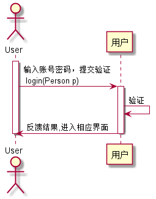
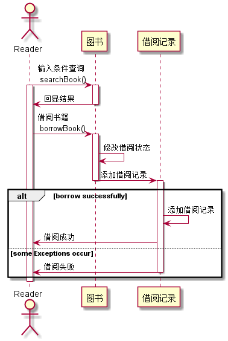
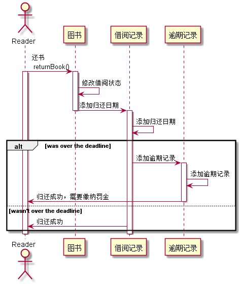
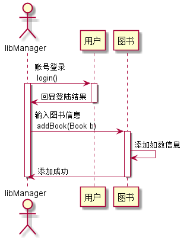

# 实验4：图书管理系统顺序图绘制
|学号|班级|姓名|照片|
|:-------:|:-------------: | :----------:|:---:|
|12345678|软件(本)16-2|郭高余||

## 图书管理系统的顺序图
---
主要描述了 __登录__、__借阅图书__、__归还图书__、__录入图书__ 四个用例的时序图。

## 1. 登录用例
## 1.1. 登录用例PlantUML源码

``` sequence
@startuml
actor Person
Person -> 登录界面 :输入用户名密码
database 数据库
activate Person
activate 登录界面
登录界面 -> 数据库 :验证
activate 数据库
数据库 -> 登录界面 :反馈结果
deactivate 数据库
Person <- 登录界面 :进入相应界面
deactivate 登录界面
deactivate Person
@enduml
```

## 1.2. 借书用例顺序图


## 1.3. 借书用例顺序图说明
Person是各个角色所继承的抽象类，此处也抽象表示一个用户。<br>
- 在登录界面输入账号密码（登录界面activate）。
- 然后传输给数据可匹配验证（数据库activate）。
- 然后返回结果（数据库deactivate），用户可以进入系统或者无法进入系统（登录界面、Person deactivate）。

***

## 2. 借阅图书用例
## 2.1. 借阅图书用例PlantUML源码

``` sequence
@startuml
actor Reader
participant "图书" as book
participant "借阅记录" as borrowNotice

Reader -> book :输入条件查询\n searchBook()
activate Reader
activate book
book -> Reader :回显结果
deactivate book
Reader -> borrowNotice :借阅书籍\n borrowBook()
activate borrowNotice
alt borrow successfully
    borrowNotice -> borrowNotice :添加借阅记录
    activate borrowNotice
    borrowNotice -> Reader :借阅成功
    deactivate borrowNotice
else some Exceptions occur
    borrowNotice -> Reader :借阅失败
    deactivate borrowNotice
end
deactivate Reader
@enduml
```

## 2.2. 借阅图书用例顺序图


## 2.3. 借阅图书用例顺序图说明
- Reader输入查询条件，返回查询结果(Reader、图书 activate)。
- Reader借阅图书，修改图书借阅状态为借出（图书activate），传输图书信息给借阅记录(借阅记录activate)。
- 如果能借，借阅记录则添加一条记录(借阅记录activate)，并反馈成功信息。
- 如不能借，则直接反馈失败信息。
***

## 3. 归还图书用例
## 3.1. 归还图书用例PlantUML源码

``` sequence
@startuml
actor Reader
participant 图书 as book
participant 借阅记录 as borrowNotice
participant 逾期记录 as overDeadLineNotice

Reader -> book :还书\n returnBook()
activate Reader
activate book
activate book
book -> book :修改借阅状态
deactivate book
book -> borrowNotice :添加归还日期
deactivate book
activate borrowNotice
activate borrowNotice
borrowNotice -> borrowNotice :添加归还日期
deactivate borrowNotice
alt was over the deadline
    borrowNotice -> overDeadLineNotice :添加逾期记录
    activate overDeadLineNotice
    activate overDeadLineNotice
    overDeadLineNotice -> overDeadLineNotice :添加逾期记录
    deactivate overDeadLineNotice
    overDeadLineNotice -> Reader :归还成功，需要缴纳罚金
    deactivate overDeadLineNotice
else wasn't over the deadline
    borrowNotice -> Reader :归还成功
end
@enduml
```

## 3.2. 归还图书用例顺序图


## 3.3. 归还图书用例顺序图说明
- Reader归还图书，扫描图书信息后(Reader activate)，将图书借阅状态改为未借出(图书activate)，再传输数据给借阅记录表添加归还日期（借阅记录activate）。
- 图书借阅记录添加后（图书借阅activate），判断是否逾期。
- 如果逾期，则传递数据给逾期记录表（逾期记录activate），添加逾期记录，并给Reader回显归还结果。
- 如果没有逾期，直接给Reader回显归还结果。
***

## 4. 录入图书用例
## 4.1. 录入添加图书用例PlantUML源码

``` sequence
@startuml
actor libManager
participant 登录界面 as login
participant 图书 as book
libManager -> login :账号登录\n login()
activate libManager 
activate login
login -> libManager :回显登陆结果
deactivate login

libManager -> book :输入图书信息\n addBook()
activate libManager
activate book
activate book
book -> book :添加如数信息
deactivate book
book -> libManager :添加成功
deactivate book
deactivate libManager
deactivate libManager
@enduml
```

## 4.2. 录入图书用例顺序图


## 4.3. 录入图书用例顺序图说明
- 图书管理员登录系统（图书管理员activate）。
- 图书管理员输入图书信息。（图书管理员activate）。
- 图书添加新数据（图书activate）。
- 回显结果。
***