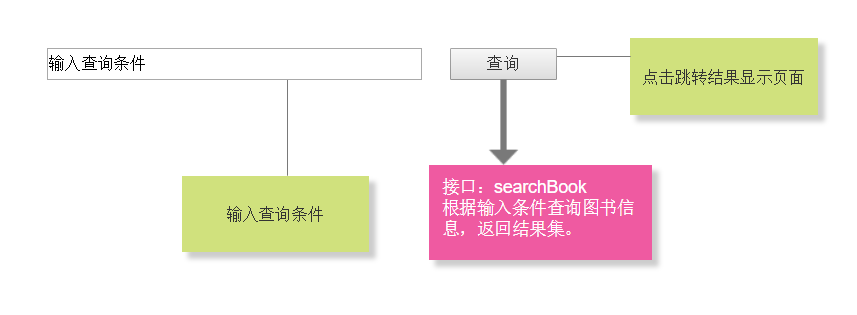

# 实验5：图书管理系统数据库设计与界面设计
|学号|班级|姓名|照片|
|:-------:|:-------------: | :----------:|:---:|
|201610414206|软件(本)16-2|HolyKwok||

## 1.数据库表设计

## 1.1. 图书表
|字段|类型|主键，外键|可以为空|默认值|约束|说明|
|:-------:|:-------------:|:------:|:----:|:---:|:----:|:-----|
|BookId     |varchar(12)   |主键|否| |Primary Key|图书ID（索引号）|
|BookName   |varchar(20)   | |否| | |书名|
|author     |varchar(20)   | |是|None| |作者|
|publication|varchar(50)   | |是|None| |出版社|
|price      |int           | |是|0.0|price>=0;浮点数|不添加则0.0元|
|num        |int           | |是|0|num>=0;整数|馆藏数量，不添加则为0|
|status     |int           | |是|0| |1:可借;0:不可借|

## 1.2. 用户表
|字段|类型|主键，外键|可以为空|默认值|约束|说明|
|:-------:|:-------------:|:------:|:----:|:---:|:----:|:-----|
|userId     |varchar(12)   |主键|否| |primary key|用户名|
|pwd        |varchar(16)   | |否| | |密码|


## 1.3. 读者表
|字段|类型|主键，外键|可以为空|默认值|约束|说明|
|:-------:|:-------------:|:------:|:----:|:---:|:----:|:-----|
|readerId   |varchar(12)   |主键|否| | primary key|读者id|
|userId     |varchar(12)   |外键|否| ||用户名|
|name       |varchar(20)   | |否| | | 密码|
|isPass     |int           | |是|0| |是否通过系统管理员审核，0:没有;1:通过|

## 1.4. 图书管理员表
|字段|类型|主键，外键|可以为空|默认值|约束|说明|
|:-------:|:-------------:|:------:|:----:|:---:|:----:|:-----|
|libManagerId|varchar(12)   |主键|否| | primary key|图书管理员id|
|userId     |varchar(12)   |外键|否| ||用户名|
|name        |varchar(20)   | |否| | |密码|
|isPass      |int           | |是|0| |是否通过系统管理员审核，0:没有;1:通过|


## 1.5. 系统管理员表
|字段|类型|主键，外键|可以为空|默认值|约束|说明|
|:-------:|:-------------:|:------:|:----:|:---:|:----:|:-----|
|sysManagerId |varchar(12)  |主键|否| | primary key|系统管理员id|
|userId     |varchar(12)   |外键|否| ||用户名|


## 1.6. 借阅记录表
|字段|类型|主键，外键|可以为空|默认值|约束|说明|
|:-------:|:-------------:|:------:|:----:|:---:|:----:|:-----|
|noticeId   |int           |主键|否| |Primary Key|自增ID|
|BookId     |varchar(12)   |外键|否| | |图书ID（索引号）|
|readerId   |varchar(20)   |外键|否| | |读者ID|
|startDate  |datetime      | |否| | |借阅日期|
|returnDate |datetime      | |是|None| |归还日期，初始为空，归还后记录|
|status     |int           | |是|0| |借阅状态，已归还:1;未归还:0|


## 1.7. 逾期记录表
|字段|类型|主键，外键|可以为空|默认值|约束|说明|
|:-------:|:-------------:|:------:|:----:|:---:|:----:|:-----|
|noticeId   |int           |主键|否| |Primary Key|自增ID|
|BookId     |varchar(12)   |外键|否| | |图书ID（索引号）|
|readerId   |varchar(20)   |外键|否| | |读者ID|
|overDays   |int           | |否| |overDays>=1|逾期时间|
|status     |int           | |是|0| |支付状态，已已支付:1;未支付:0|


***

## 2. 界面设计
## 2.1. 修改图书信息界面设计

<br>（默认图书管理员已经登录系统）__index.html__

__search_result.html__

__modify_book_info.html__
### __连接如下:__[UI页面]: https://applausewow.github.io/is_analysis_pages/ui/index.html "UI design"
- 用例图参见：修改图书信息用例
- 类图参见：图书管理员类、图书类
- 顺序图参见：修改图书信息顺序图
- API接口如下：

### 1. 获取图书查询结果

- 功能：用于获取图书信息
- 请求地址： http://www.applausewow.cn/library/v1/api/searchBook/book_name
- 请求方法：GET
- 请求参数：

|参数名称|必填|说明|
|:-------:|:-------------: | :----------:|
|book_name|是|书名。 |


- 返回实例：
```
{
    "info": "查询成功"
    "data": {
        "bookName": "快学Scala",
        "bookId": "14361",
        "publication": "电子工业出版社",
        "author": "[美]C.S.霍斯曼",
        "price": 78.0,
        "num": 1,
        "loc": "社科阅览室",
        "status": "可借"
    },
    "code": 200
}
```
- 返回参数说明：
    
|参数名称|说明|
|:-------:|:-------------: |
|Info|返回查询结果信息|
|data|图书信息（书名、图书ID、出版社、作者、价格、馆藏数、定位、借阅状态）|
|code|返回状态码|

### 2. 修改图书信息API
- 功能：用于修改图书信息
- 请求地址： http://www.applausewow/library/v1/api/modify_book_info/bookId
- 请求方法：GET
- 请求参数：

|参数名称|必填|说明|
|:-------:|:-------------: | :----------:|
|bookId|是|图书唯一ID。 |

- 返回实例：
```
{
    "info": "图书信息。",
    "data": {
            "bookName": "快学Scala",
            "bookId": "14361",
            "publication": "电子工业出版社",
            "author": "[美]C.S.霍斯曼",
            "price": 78.0,
            "num": 1,
            "loc": "社科阅览室"
            "status": "可借"
        },
    "code": 200
}
```
- 返回参数说明：
    
|参数名称|说明|
|:-------:|:-------------: |
|Info|返回信息|
|data|图书信息|
|code|返回状态码|

### 3. 保存图书信息API
- 功能：用于保存修改后图书信息
- 请求地址： http://www.applausewow/library/v1/api/save_book_info?bookId=...&bookName=...&...
- 请求方法：PUT
- 请求参数：

|参数名称|必填|说明|
|:-------:|:-------------: | :----------:|
|bookId|是|图书唯一ID。|
|bookName|是|书名。|
|publication|是|出版社。 |
|author|是|作者。 |
|price|是|图书价格。 |
|num|是|图书馆藏数。 |
|loc|是|图书定位。 |
|status|是|借阅状态。 |


- 返回实例：
```
{
    "info": "修改成功。",
    "status": true,
    "code": 200
}
```
- 返回参数说明：
    
|参数名称|说明|
|:-------:|:-------------: |
|Info|返回信息|
|status|修改状态|
|dodo|返回状态码|

 
