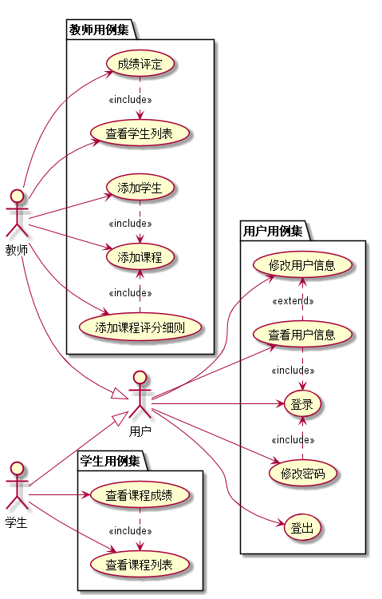

# 基于GitHub的实验管理平台的分析与设计

### 成都大学信息科学与工程学院

|学号|班级|姓名|照片|
|:-------:|:-------------: | :----------:|:---:|
|201610414206|软件(本)16-2|郭高余||

## 1. 概述
- 基于GitHub的实验管理平台的作用是在线管理实验成绩的Web应用系统。学生和老师的实验内容均存放在GitHUB
页面上。
- 学生的功能主要有：一是设置自己的GitHub用户名，二是查询自己的实验成绩。学生的GitHub用户名是公开的，但成绩不公开。
- 老师的功能主要有：一是添加课程，二是添加每个实验的评分项，三是查看每个学生的成绩并且评分。
- 老师和学生都能通过本系统的链接方便地跳转到学生的每个GitHUB实验目录，以便批改实验或者查看实验情况。
- 实验成绩按数字分数计算，每项实验的满分为100分，最低为0分。
- 系统自动计算每个学生的所有实验的平均分。
    
## 2. 系统总体结构

界面设计参见：https://ApplauseWow.github.io/is_analysis_pages/final/login.html
    
## 3. 用例图设计 [源码](src/sysCase.puml)

## 4. 类图设计 [源码](src/class.puml)

## 5. 数据库设计
- ### [参见数据库设计](./DataTables.md)

## 6. 用例及界面详细设计
- ### [“查看学生列表”用例](./case/showStuList.md),[界面](https://ApplauseWow.github.io/is_analysis_pages/final/index.html)
- ### [“成绩评定”用例](./case/giveScore.md),[界面](https://ApplauseWow.github.io/is_analysis_pages/final/score.html)
- ### [“查看课程成绩”用例](./case/showScores.md),[界面](https://ApplauseWow.github.io/is_analysis_pages/final/score.html)
- ### [“修改密码”用例](./case/modifyPwd.md),[界面](https://ApplauseWow.github.io/is_analysis_pages/final/modifypwd.html)
- ### [“修改用户信息”用例](./case/modifySelfInfo.md),[界面](https://ApplauseWow.github.io/is_analysis_pages/final/selfinfo.html)
- ### [“查看用户信息”用例](./case/showSelfInfo.md),[界面](https://ApplauseWow.github.io/is_analysis_pages/final/selfinfo.html)
- ### [“登出”用例](./case/logout.md),[界面](https://ApplauseWow.github.io/is_analysis_pages/final/index.html)
- ### [“登录”用例](./case/login.md),[界面](https://ApplauseWow.github.io/is_analysis_pages/final/login.html)
- ### [“添加学生”用例](./case/addStudents.md),[界面](https://ApplauseWow.github.io/is_analysis_pages/final/addstudent.html)
- ### [“添加课程”用例](./case/addCourse.md),[界面](https://ApplauseWow.github.io/is_analysis_pages/final/addcourse.html)
- ### [“添加课程评分细则”用例](case/addScoreItem.md),[界面](https://ApplauseWow.github.io/is_analysis_pages/final/addscoreitem.html)
- ### [“查看课程列表”用例](./case/showCourseList.md),[界面](https://ApplauseWow.github.io/is_analysis_pages/final/index.html)
