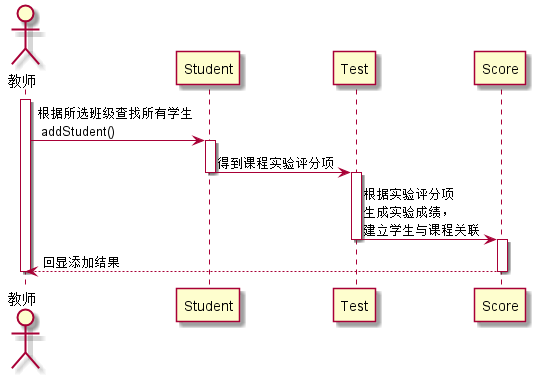

# “添加学生”用例 [返回](../README.md)
## 1. 用例规约

|用例名称|添加学生|
|-------|:-------------|
|功能|老师添加授课学生|
|参与者|老师|
|前置条件|添加授课学生之前，老师需要先登录并且添加课程以及添加课程实验评分细则|
|后置条件| 授课学生班级提交之后，系统自动保存学生名单，并生成对应的实验成绩表|
|主事件流| 1.选择与自己相同学校的学生班级并提交|
|备选事件流|1a. 学生班级不能为空  &nbsp;&nbsp; 1.提示用户重新选择|

## 2. 业务流程（顺序图）[源码](../src/seq_addStudents.puml)
 

    
## 3. 界面设计
- 界面参照: https://ApplauseWow.github.io/is_analysis_pages/final/addStudent.html

- API接口调用

    - 接口1：[addStudents](../interface/addStudents.md)
        
        保存提交授课学生班级
         
    
## 4. 算法描述
    无
    
## 5. 参照表

- [Studnet](../DataTables.md/#STUDENTS)
- [Test](../DataTables.md/#TESTS)
