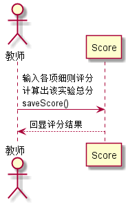

# “成绩评定”用例 [返回](../README.md)
## 1. 用例规约

|用例名称|成绩评定|
|-------|:-------------|
|功能|老师评定一个学生的实验成绩|
|参与者|老师|
|前置条件|查看成绩：评定成绩之前，老师需要先登录，并显示出一个学生的所有实验成绩和评语信息|
|后置条件| 评定成绩提交之后，系统自动计算平均成绩|
|主事件流| 1. 查看已有的成绩   2. 输入一个或者多个实验的成绩和评语    3. 提交    4. 系统存储实验成绩和评语  5. 系统自动计算平均成绩|
|备选事件流|2a. 成绩必须是0至100之间，可以为空，但不能超界  &nbsp;&nbsp; 1.提示用户重新输入成绩分数|

## 2. 业务流程（顺序图） [源码](../src/seq_giveScore.puml)
 

    
## 3. 界面设计
- 界面参照: https://ApplauseWow.github.io/is_analysis_pages/final/score.html

- API接口调用

    - 接口1：[getStudentScores](../interface/getStudentScores.md)
        
        获取学生所有实验的成绩和评语以及实验所对应评分项
        
    - 接口2：[saveScore](../interface/saveScore.md)
        
        保存实验成绩
         
    
## 4. 算法描述
    无
    
## 5. 参照表

- [Student](../DataTables.md/#STUDENTS)
- [Score](../DataTables.md/#GRADES)
- [Test](../DataTables.md/#TESTS)
- [Course](../DataTables.md/#COURSES)