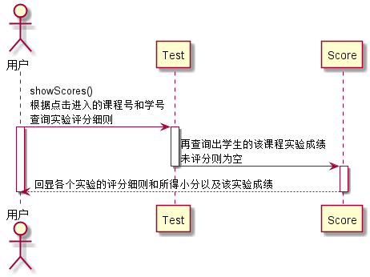

# “查看课程成绩”用例 [返回](../README.md)
## 1. 用例规约

|用例名称|查看课程成绩|
|-------|:-------------|
|功能|学生查看自己的每个实验的实验成绩及实验评价|
|参与者|学生|
|前置条件|学生需要先登录|
|后置条件| |
|主事件流| |
|备选事件流| |

## 2. 业务流程（顺序图） [源码](../src/seq_showScores.puml)
 

## 3. 界面设计
- 界面参照: https://ApplauseWow.github.io/is_analysis_pages/final/score.html
- API接口调用
    - 接口1：[getStudentScores](../interface/getStudentScores.md) 

## 4. 算法描述
    无
    
## 5. 参照表
- [Student](../DataTables.md/#STUDENTS)
- [Score](../DataTables.md/#GRADES)
- [Test](../DataTables.md/#TESTS)
