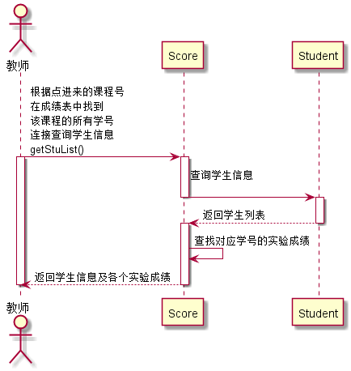

# “查看学生列表”用例 [返回](../README.md)
## 1. 用例规约

|用例名称|查看学生列表|
|-------|:-------------|
|功能|以表形式的显示出所有学生的信息|
|参与者|老师|
|前置条件|老师需要先登录|
|后置条件| |
|主事件流| |
|备选事件流| |

## 2. 业务流程（顺序图） [源码](../src/seq_getStuList.puml)
 

## 3. 界面设计
- 界面参照: https://ApplauseWow.github.io/is_analysis_pages/final/managecourese.html
- API接口调用
    - 接口1：[getAllStu](../interface/getAllStu.md) 

## 4. 算法描述
- 接口接收结果为一个映射列表（List<Map<~>>），分别装有学生信息和学生成绩
- 成绩是来自Score表，其中有N次实验的成绩，若没有评定成绩则显示N
- 平均成绩为各个实验成绩接收后运算出的结果
    
## 5. 参照表

- [Student](../DataTables.md/#STUDENTS)
- [Score](../DataTables.md/#GRADES)
- [Test](../DataTables.md/#TESTS)
